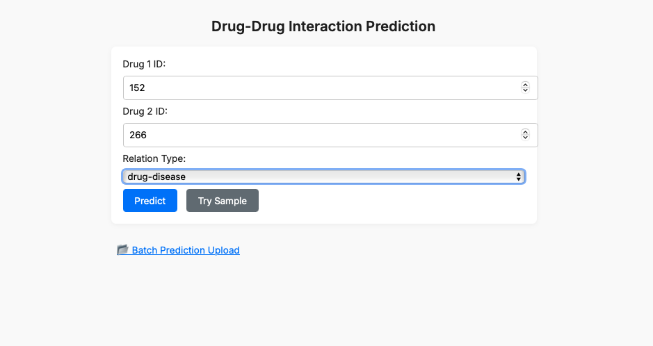
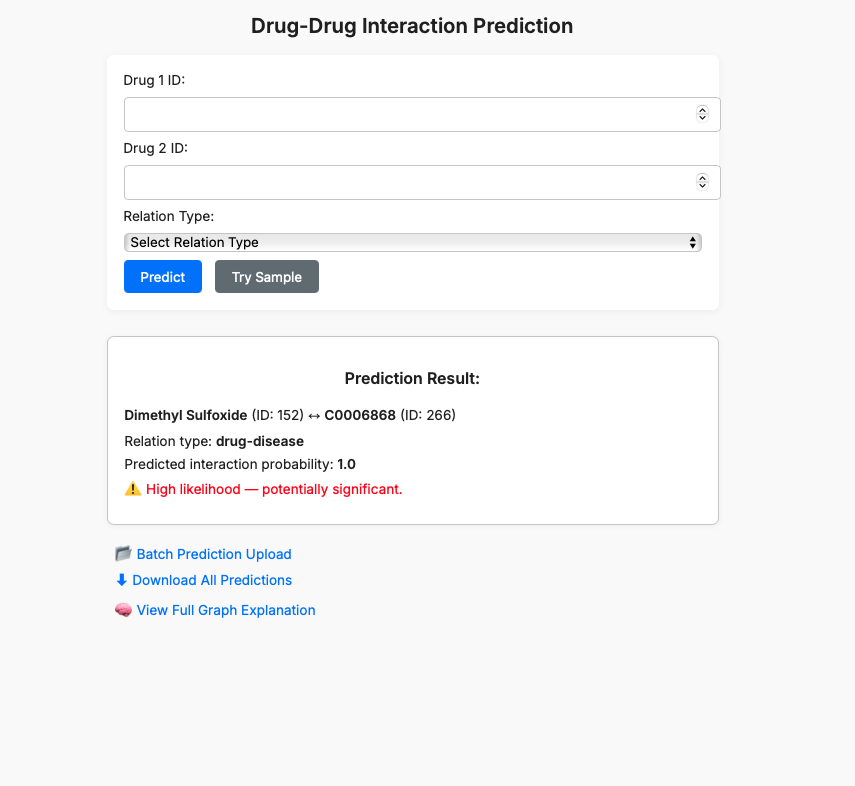
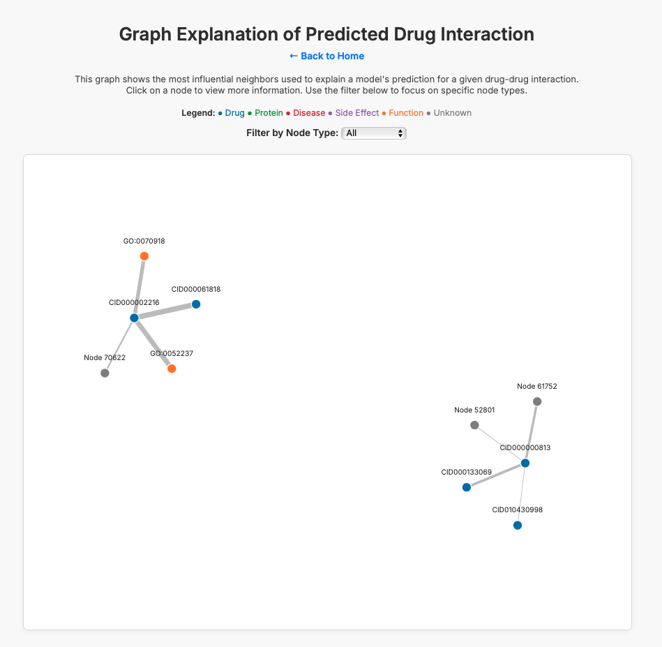

# KGNN-Drug-Drug-Interaction-DDI-Prediction

<p align="center">
  
</p>


This repository contains a production-ready web application for predicting drug-drug interactions (DDIs) using Knowledge Graph Neural Networks (KGNNs), enhanced with interactive graph explanations. The platform is designed for researchers, data scientists, and healthcare practitioners to explore predicted interactions and understand the reasoning behind them.

---

## Table of Contents

- [Introduction](#introduction)
- [Features](#features)
- [Installation](#installation)
- [Usage](#usage)
- [Web Application](#web-application)
- [Data](#data)
- [Model](#model)
- [Results](#results)
- [Sources](#sources)
- [Next Steps / TODOs](#next-steps--todos)
- [License](#license)

---

## Introduction



Drug-drug interactions can lead to severe side effects or reduced efficacy in treatment. Predicting such interactions in advance is critical in drug development and personalized medicine.

This project uses graph-based representations of biomedical entities and models their relationships using KGNNs to accurately predict interactions. It further visualizes these predictions using explainability techniques like PGExplainer and D3.js.

---

## Features



- GraphSAGE-based DDI prediction with trained embeddings
- Interactive web interface built with Flask and D3.js
- Dynamic prediction and graph-based explanation
- Node filtering by type (Drug, Protein, Side Effect, etc.)
- Node highlighting, tooltips, and clickable details with links to DrugBank
- End-to-end prediction logging to CSV

---

## Installation

Clone the repository and install dependencies:

```bash
git clone https://github.com/<your-username>/KGNN-Drug-Drug-Interaction-DDI-Prediction
cd KGNN-Drug-Drug-Interaction-DDI-Prediction
pip install -r requirements.txt
```


## Usage

```bash
python run.py
```

Access the web interface in your browser at:
```
http://localhost:5050
```

## Web Application



The web application is built using Flask and D3.js. It allows users to input drug names and visualize the predicted interactions in a graph format. The graph is interactive, allowing users to filter nodes by type and view detailed information about each node.

### Features of the Web Application

- Home Page - Inpute two drug IDs and predict interaction probability.
- Graph Explanation – View influential neighbors and edge importance.
- Download Log – Export prediction history.

## Data

The application uses the `ogbl-biokg` dataset from Open Graph Benchmark (OGB), processed into heterogeneous graph format.

  Graph converted using `to_homogeneous()` for PGExplainer, while training is done with original heterogeneous BioKG graph.

## Model

We use a custom GraphSAGE architecture to embed drug/protein entities.

- `embedding_dim = 128`
- 2-layer GraphSAGE
- Trained using edge classification over flattened edge types
- Embeddings are used for prediction:

  `score = sigmoid( dot(emb1, emb2) )`

## Results

Basic prediction results include:

- Predicted interaction probability
- Most similar neighbors via cosine similarity
- Graph explanation with edge weights
- Logging via predictions_log.csv

Future Evaluation Metrics (WIP)

- Accuracy, ROC-AUC, PR-AUC
- Precision, Recall, F1-score
- Explanation faithfulness evaluation

## Sources

- BioKG
- OGB-L BioKG Dataset
- DrugBank
- PubChem
- Hetionet

## DrugBank Integration (Optional)

This app supports optional DrugBank integration for enhanced drug metadata.
Due to licensing restrictions, you must:

1. "Apply for a [DrugBank academic license](https://go.drugbank.com/releases/latest)."
2. "Download the required files (e.g., drugbank_all_drug_links.csv)."
3. "Place them in backend/drugbank_data/ (see README)."
4. "Restart the app to enable enriched drug info in prediction results."

## Next Steps / TODOs

- ◽️Incorporate SHAP or KGNNExplainer for advanced local explanations.
- ◽️Add confidence intervals or calibration on prediction scores.
- ◽️Support additional datasets (e.g., DrugCentral, STITCH).
- ◽️Refactor model.py for GraphSAGE and R-GCN dual support.
- ◽️Add Docker and deployment instructions.
- ◽️Add unit tests and GitHub CI workflow.
- ◽️Improve responsive design and D3 performance.

## License

This project is licensed under the MIT License.
